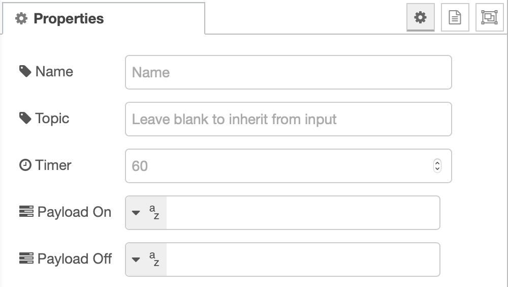
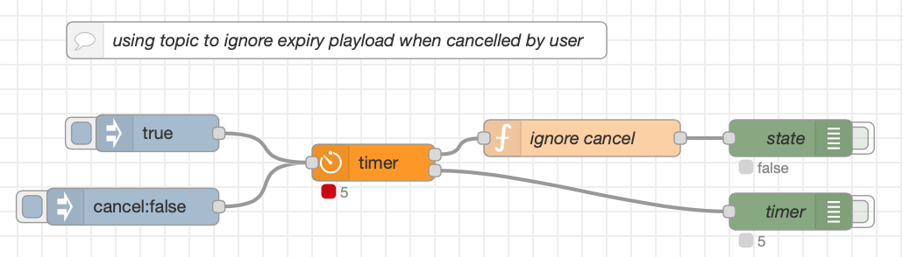
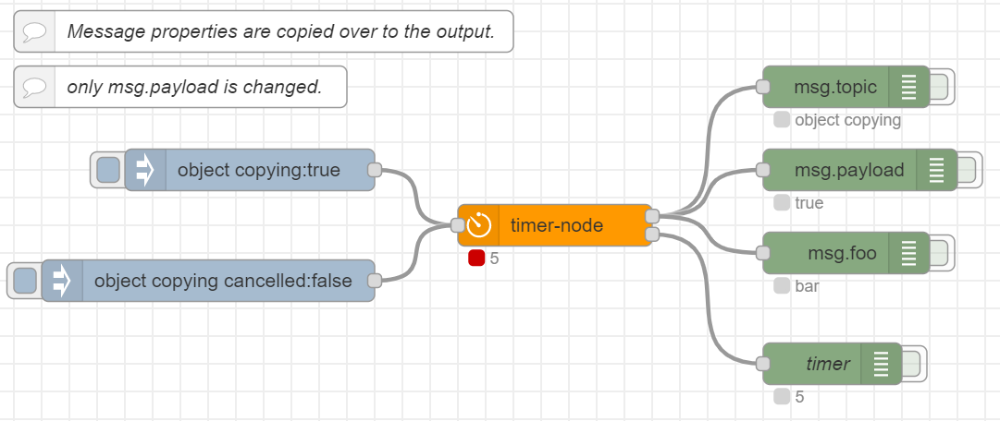
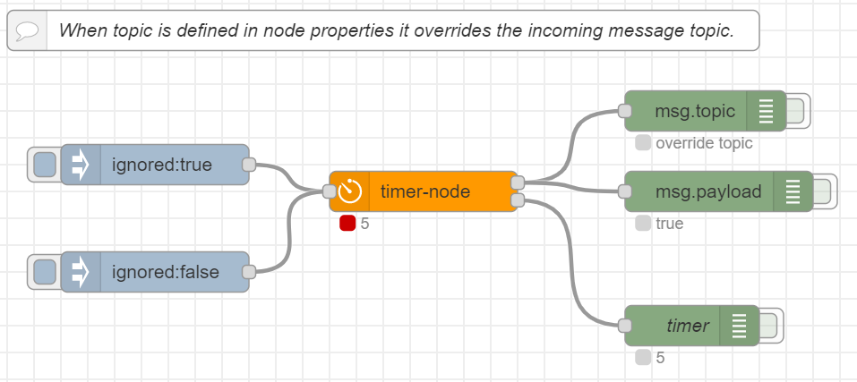

[](https://nodered.org)


# node-red-contrib-timer

node-red-contrib-timer is a rudementary timer.

---

# Getting Started

## Prerequisites

* [Node.js](https://nodejs.org/en/) v10.0.0 or newer
* [Node-RED](https://nodered.org) v1.0.0 or newer

## Installation

Install via Node-RED Manage Palette

`node-red-contrib-timer`

Install via npm

```
$ cd ~/.node-red
$ npm install node-red-contrib-timer
# then restart node-red
```

---

# Usage

### Configuration Pane



### Node input

Start and stop with `msg.payload`:

* `true` starts the timer.
* `false` stops the timer.

Set expiry time with `msg.payload`:

* `int` sets countdown in seconds.

# Examples

### Using topic to filter payload when cancelled

When no *topic* property is defined in the node, the incoming *topic* is copied over to the output. This can be used to filter out the expiry payload when the timer is cancelled.



```
[{"id":"38a5c6e.079893a","type":"tab","label":"ignore cancel","disabled":false,"info":""},{"id":"b5e83fc7.69dc8","type":"debug","z":"38a5c6e.079893a","name":"state","active":false,"tosidebar":true,"console":false,"tostatus":true,"complete":"true","targetType":"full","statusVal":"payload","statusType":"auto","x":670,"y":140,"wires":[]},{"id":"6fb05b68.183e3c","type":"debug","z":"38a5c6e.079893a","name":"timer","active":false,"tosidebar":true,"console":false,"tostatus":true,"complete":"true","targetType":"full","statusVal":"payload","statusType":"auto","x":670,"y":200,"wires":[]},{"id":"72a3e721.0cc288","type":"inject","z":"38a5c6e.079893a","name":"","props":[{"p":"payload"},{"p":"topic","vt":"str"}],"repeat":"","crontab":"","once":false,"onceDelay":0.1,"topic":"cancel","payload":"false","payloadType":"bool","x":134,"y":196,"wires":[["d96dea31904032b8"]]},{"id":"84f20a87.3a0308","type":"inject","z":"38a5c6e.079893a","name":"","props":[{"p":"payload"}],"repeat":"","crontab":"","once":false,"onceDelay":0.1,"topic":"","payload":"true","payloadType":"bool","x":154,"y":136,"wires":[["d96dea31904032b8"]]},{"id":"48ce8bab.3c0634","type":"function","z":"38a5c6e.079893a","name":"ignore cancel","func":"if (msg.topic != 'cancel') {\n    return msg;\n}","outputs":1,"noerr":0,"initialize":"","finalize":"","x":500,"y":140,"wires":[["b5e83fc7.69dc8"]]},{"id":"225ff94.486e486","type":"comment","z":"38a5c6e.079893a","name":"Incoming message topic can be copied over to the output.","info":"","x":250,"y":40,"wires":[]},{"id":"d96dea31904032b8","type":"timer-node","z":"38a5c6e.079893a","name":"","topic":"","timer":"5","payloadOn":"false","payloadOnType":"bool","payloadOff":"true","payloadOffType":"bool","x":310,"y":160,"wires":[["48ce8bab.3c0634"],["6fb05b68.183e3c"]]},{"id":"bd55ac20a78e44fc","type":"comment","z":"38a5c6e.079893a","name":"This example uses a function node to filter out the expiry payload when timer is cancelled.","info":"","x":350,"y":80,"wires":[]}]
```

### Message property propagation

Properties defined in the incoming `msg` object are copied over to the outputs. The payload is changed and topic (if defined in the node).



```
[{"id":"8af9695e.73126","type":"tab","label":"msg property propagation","disabled":false,"info":""},{"id":"43d996ab.f0fa48","type":"inject","z":"8af9695e.73126","name":"","props":[{"p":"payload"},{"p":"topic","vt":"str"},{"p":"foo","v":"bar","vt":"str"}],"repeat":"","crontab":"","once":false,"onceDelay":0.1,"topic":"object copying","payload":"true","payloadType":"bool","x":190,"y":140,"wires":[["1421f228d1843b9b"]]},{"id":"c830b39e.c0c1","type":"debug","z":"8af9695e.73126","name":"timer","active":false,"tosidebar":true,"console":false,"tostatus":true,"complete":"true","targetType":"full","statusVal":"payload","statusType":"auto","x":610,"y":280,"wires":[]},{"id":"3a0fe194.c88de6","type":"debug","z":"8af9695e.73126","name":"","active":false,"tosidebar":true,"console":false,"tostatus":true,"complete":"payload","targetType":"msg","statusVal":"payload","statusType":"auto","x":630,"y":140,"wires":[]},{"id":"40a132b2.d74a8c","type":"debug","z":"8af9695e.73126","name":"","active":false,"tosidebar":true,"console":false,"tostatus":true,"complete":"foo","targetType":"msg","statusVal":"payload","statusType":"auto","x":620,"y":200,"wires":[]},{"id":"d2e4815a.235dd","type":"debug","z":"8af9695e.73126","name":"","active":false,"tosidebar":true,"console":false,"tostatus":true,"complete":"topic","targetType":"msg","statusVal":"payload","statusType":"auto","x":620,"y":80,"wires":[]},{"id":"3b550efa.cdb4aa","type":"inject","z":"8af9695e.73126","name":"","props":[{"p":"payload"},{"p":"topic","vt":"str"},{"p":"foo","v":"cis boom bah","vt":"str"}],"repeat":"","crontab":"","once":false,"onceDelay":0.1,"topic":"object copying cancelled","payload":"false","payloadType":"bool","x":160,"y":220,"wires":[["1421f228d1843b9b"]]},{"id":"8d7ff426.ad474","type":"comment","z":"8af9695e.73126","name":"Message properties are copied over to the output.","info":"","x":200,"y":40,"wires":[]},{"id":"1421f228d1843b9b","type":"timer-node","z":"8af9695e.73126","name":"","topic":"","timer":"5","payloadOn":"false","payloadOnType":"bool","payloadOff":"true","payloadOffType":"bool","x":410,"y":180,"wires":[["d2e4815a.235dd","3a0fe194.c88de6","40a132b2.d74a8c"],["c830b39e.c0c1"]]},{"id":"c81e85b84437fd8a","type":"comment","z":"8af9695e.73126","name":"only msg.payload is changed.","info":"","x":140,"y":80,"wires":[]}]
```

### Override msg.topic in properties

When *topic* is defined in the node properties, incoming *msg.topic* is overriden.



```
[{"id":"3f3d6774.cce2f","type":"tab","label":"topic override","disabled":false,"info":""},{"id":"c11b7d9c.021958","type":"inject","z":"3f3d6774.cce2f","name":"","props":[{"p":"topic","vt":"str"},{"p":"payload"}],"repeat":"","crontab":"","once":false,"onceDelay":0.1,"topic":"ignored","payload":"true","payloadType":"bool","x":150,"y":140,"wires":[["bf0781a1230c42ac"]]},{"id":"3706780.96a0c08","type":"inject","z":"3f3d6774.cce2f","name":"","props":[{"p":"topic","vt":"str"},{"p":"payload"}],"repeat":"","crontab":"","once":false,"onceDelay":0.1,"topic":"ignored","payload":"false","payloadType":"bool","x":150,"y":220,"wires":[["bf0781a1230c42ac"]]},{"id":"5d48ca08.c9c664","type":"debug","z":"3f3d6774.cce2f","name":"","active":false,"tosidebar":true,"console":false,"tostatus":true,"complete":"topic","targetType":"msg","statusVal":"payload","statusType":"auto","x":560,"y":100,"wires":[]},{"id":"4e8c7759.a6b17","type":"debug","z":"3f3d6774.cce2f","name":"timer","active":false,"tosidebar":true,"console":false,"tostatus":true,"complete":"true","targetType":"full","statusVal":"payload","statusType":"auto","x":550,"y":260,"wires":[]},{"id":"edfec9d6.4e066","type":"debug","z":"3f3d6774.cce2f","name":"","active":false,"tosidebar":true,"console":false,"tostatus":true,"complete":"payload","targetType":"msg","statusVal":"payload","statusType":"auto","x":570,"y":160,"wires":[]},{"id":"d9fa71cd.4df948","type":"comment","z":"3f3d6774.cce2f","name":"When topic is defined in node properties it overrides the incoming message topic.","info":"","x":320,"y":40,"wires":[]},{"id":"bf0781a1230c42ac","type":"timer-node","z":"3f3d6774.cce2f","name":"","topic":"override topic","timer":"5","payloadOn":"false","payloadOnType":"bool","payloadOff":"true","payloadOffType":"bool","x":350,"y":160,"wires":[["5d48ca08.c9c664","edfec9d6.4e066"],["4e8c7759.a6b17"]]}]
```

# TODO

- [] Improve documention
- [] unit testing
- [] publish workflow (run tests, publish release, publish package, publish package to NPM)
- [] change node colour